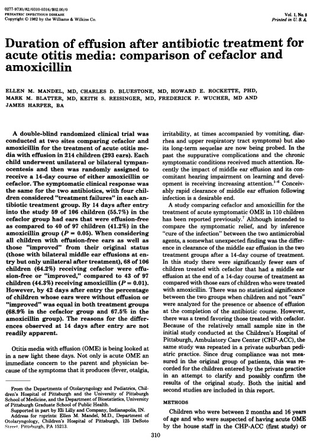

## {.custom-title background-color="#033c5a"}

::: {.ct-series}
Statistical Inference with R
:::

::: {.ct-title}
Inference for Categorical Data
:::

::: {.ct-subtitle}
Chi-square tests, proportions, and contingency tables in R
:::

::: {.ct-author}
Dan Kerchner · George Washington University Libraries & Academic Innovation · Fall 2026
:::

## Upcoming R Workshops (Fall 2026) 🗓️ {background-color="#033c5a" .divider .smaller}

- **Sept. 29 (Tues.), 12:30-2:30pm** | *Statistical Inference with R: Linear & Logistic Regression Modeling*
- **Oct. 1 (Thurs.), 1pm-3:30pm** | *Farther into R: More R for Data Analysis*

There will be more in the Spring!


📅 Find all GW Libraries workshops and events at
_[library.gwu.edu/events](https://library.gwu.edu/events)_

## What are we actually doing?

```{=html}
<svg class="inference-diagram" viewBox="0 0 1000 490" role="img"
     aria-label="A population of fifty figures, all GW graduate students; six are drawn at random to form a sample, each one recorded as an A student or not, the sample proportion p-hat equals 0.67 is computed, and that statistic is used to estimate the unknown population proportion p, giving both a point estimate and a confidence interval.">
  <defs>
    <g id="inf-person">
      <circle cx="0" cy="-8" r="4.6"/>
      <path d="M0,-2.2 c-4,0 -6.6,2.6 -6.6,6.4 V10 h13.2 V4.2 c0,-3.8 -2.6,-6.4 -6.6,-6.4 Z"/>
    </g>
    <marker id="inf-head" viewBox="0 0 10 10" refX="9" refY="5"
            markerWidth="5" markerHeight="5" orient="auto-start-reverse">
      <path d="M0,0 L10,5 L0,10 Z" class="inf-arrowhead"/>
    </marker>
    <marker id="inf-head-buff" viewBox="0 0 10 10" refX="9" refY="5"
            markerWidth="5" markerHeight="5" orient="auto-start-reverse">
      <path d="M0,0 L10,5 L0,10 Z" class="inf-arrowhead inf-arrowhead--buff"/>
    </marker>
  </defs>

  <!-- ── Population ───────────────────────────────────────────── -->
  <text class="inf-label" x="30" y="42">POPULATION<tspan class="inf-label-note" dx="10">· all GW graduate students</tspan></text>
  <rect class="inf-panel" x="30" y="52" width="400" height="250" rx="12"/>
  <g class="inf-person">
    <use href="#inf-person" transform="translate(68,98) scale(1.5)"/>
    <use href="#inf-person" transform="translate(104,98) scale(1.5)"/>
    <use href="#inf-person" transform="translate(140,98) scale(1.5)"/>
    <use href="#inf-person" transform="translate(176,98) scale(1.5)"/>
    <use href="#inf-person" transform="translate(212,98) scale(1.5)"/>
    <use href="#inf-person" transform="translate(248,98) scale(1.5)"/>
    <use href="#inf-person" transform="translate(284,98) scale(1.5)"/>
    <use href="#inf-person" transform="translate(320,98) scale(1.5)"/>
    <use href="#inf-person" transform="translate(356,98) scale(1.5)"/>
    <use href="#inf-person" transform="translate(392,98) scale(1.5)"/>
    <use href="#inf-person" transform="translate(68,140) scale(1.5)"/>
    <use href="#inf-person" transform="translate(104,140) scale(1.5)"/>
    <use href="#inf-person" transform="translate(140,140) scale(1.5)"/>
    <use href="#inf-person" transform="translate(176,140) scale(1.5)"/>
    <use href="#inf-person" transform="translate(212,140) scale(1.5)"/>
    <use href="#inf-person" transform="translate(248,140) scale(1.5)"/>
    <use href="#inf-person" transform="translate(284,140) scale(1.5)"/>
    <use href="#inf-person" transform="translate(320,140) scale(1.5)"/>
    <use href="#inf-person" transform="translate(356,140) scale(1.5)"/>
    <use href="#inf-person" transform="translate(392,140) scale(1.5)"/>
    <use href="#inf-person" transform="translate(68,182) scale(1.5)"/>
    <use href="#inf-person" transform="translate(104,182) scale(1.5)"/>
    <use href="#inf-person" transform="translate(140,182) scale(1.5)"/>
    <use href="#inf-person" transform="translate(176,182) scale(1.5)"/>
    <use href="#inf-person" transform="translate(212,182) scale(1.5)"/>
    <use href="#inf-person" transform="translate(248,182) scale(1.5)"/>
    <use href="#inf-person" transform="translate(284,182) scale(1.5)"/>
    <use href="#inf-person" transform="translate(320,182) scale(1.5)"/>
    <use href="#inf-person" transform="translate(356,182) scale(1.5)"/>
    <use href="#inf-person" transform="translate(392,182) scale(1.5)"/>
    <use href="#inf-person" transform="translate(68,224) scale(1.5)"/>
    <use href="#inf-person" transform="translate(104,224) scale(1.5)"/>
    <use href="#inf-person" transform="translate(140,224) scale(1.5)"/>
    <use href="#inf-person" transform="translate(176,224) scale(1.5)"/>
    <use href="#inf-person" transform="translate(212,224) scale(1.5)"/>
    <use href="#inf-person" transform="translate(248,224) scale(1.5)"/>
    <use href="#inf-person" transform="translate(284,224) scale(1.5)"/>
    <use href="#inf-person" transform="translate(320,224) scale(1.5)"/>
    <use href="#inf-person" transform="translate(356,224) scale(1.5)"/>
    <use href="#inf-person" transform="translate(392,224) scale(1.5)"/>
    <use href="#inf-person" transform="translate(68,266) scale(1.5)"/>
    <use href="#inf-person" transform="translate(104,266) scale(1.5)"/>
    <use href="#inf-person" transform="translate(140,266) scale(1.5)"/>
    <use href="#inf-person" transform="translate(176,266) scale(1.5)"/>
    <use href="#inf-person" transform="translate(212,266) scale(1.5)"/>
    <use href="#inf-person" transform="translate(248,266) scale(1.5)"/>
    <use href="#inf-person" transform="translate(284,266) scale(1.5)"/>
    <use href="#inf-person" transform="translate(320,266) scale(1.5)"/>
    <use href="#inf-person" transform="translate(356,266) scale(1.5)"/>
    <use href="#inf-person" transform="translate(392,266) scale(1.5)"/>
  </g>

  <!-- ── The parameter we want (always on screen) ──────────────── -->
  <text class="inf-note" x="230" y="328" text-anchor="middle">the proportion earning an A</text>
  <rect class="inf-box inf-box--unknown" x="30" y="340" width="400" height="125" rx="12"/>
  <text class="inf-symbol" x="230" y="385" text-anchor="middle">p = ?</text>
  <text class="inf-caption" x="230" y="409" text-anchor="middle">parameter &#8212; fixed, but unknown</text>

  <!-- ── The two things we want to say about it ─────────────────── -->
  <rect class="inf-goal-chip" x="50" y="422" width="172" height="34" rx="8"/>
  <text class="inf-goal" x="136" y="444" text-anchor="middle">point estimate</text>
  <rect class="inf-goal-chip" x="238" y="422" width="172" height="34" rx="8"/>
  <text class="inf-goal" x="324" y="444" text-anchor="middle">confidence interval</text>

  <!-- ── Step 1: draw the sample ───────────────────────────────── -->
  <g class="fragment">
    <g class="inf-person inf-person--drawn">
      <use href="#inf-person" transform="translate(104,98) scale(1.5)"/>
      <use href="#inf-person" transform="translate(284,98) scale(1.5)"/>
      <use href="#inf-person" transform="translate(356,140) scale(1.5)"/>
      <use href="#inf-person" transform="translate(176,182) scale(1.5)"/>
      <use href="#inf-person" transform="translate(68,224) scale(1.5)"/>
      <use href="#inf-person" transform="translate(248,266) scale(1.5)"/>
    </g>

    <circle class="inf-step-badge" cx="452" cy="138" r="14"/>
    <text class="inf-step-num" x="452" y="145" text-anchor="middle">1</text>
    <text class="inf-step" x="474" y="145">draw at random</text>
    <line class="inf-arrow" x1="440" y1="180" x2="630" y2="180" marker-end="url(#inf-head)"/>
    <text class="inf-note" x="535" y="212" text-anchor="middle">and note who earned an A</text>

    <text class="inf-label" x="640" y="42">SAMPLE<tspan class="inf-label-note" dx="10">· n = 6</tspan></text>
    <rect class="inf-panel inf-panel--sample" x="640" y="52" width="330" height="250" rx="12"/>
    <g class="inf-person inf-person--drawn">
      <use href="#inf-person" transform="translate(717,135) scale(2)"/>
      <use href="#inf-person" transform="translate(805,135) scale(2)"/>
      <use href="#inf-person" transform="translate(893,135) scale(2)"/>
      <use href="#inf-person" transform="translate(717,225) scale(2)"/>
      <use href="#inf-person" transform="translate(805,225) scale(2)"/>
      <use href="#inf-person" transform="translate(893,225) scale(2)"/>
    </g>
    <g class="inf-value" text-anchor="middle">
      <text x="717" y="173">A</text>
      <text class="inf-value--muted" x="805" y="173">not A</text>
      <text x="893" y="173">A</text>
      <text class="inf-value--muted" x="717" y="263">not A</text>
      <text x="805" y="263">A</text>
      <text x="893" y="263">A</text>
    </g>
  </g>

  <!-- ── Step 2: compute the statistic ─────────────────────────── -->
  <g class="fragment">
    <line class="inf-arrow" x1="805" y1="306" x2="805" y2="356" marker-end="url(#inf-head)"/>
    <circle class="inf-step-badge" cx="846" cy="318" r="13"/>
    <text class="inf-step-num" x="846" y="325" text-anchor="middle">2</text>
    <text class="inf-step" x="866" y="325">compute</text>
    <rect class="inf-box" x="640" y="360" width="330" height="105" rx="12"/>
    <text class="inf-symbol" x="690" y="405">p = 4/6 = 0.67</text>
    <polyline class="inf-symbol-hat" points="690,382 698,373 706,382"/>
    <text class="inf-caption" x="805" y="437" text-anchor="middle">statistic &#8212; known, but random</text>
  </g>

  <!-- ── Step 3: infer back to the parameter ───────────────────── -->
  <g class="fragment">
    <circle class="inf-step-badge inf-step-badge--buff" cx="492" cy="380" r="13"/>
    <text class="inf-step-num" x="492" y="387" text-anchor="middle">3</text>
    <text class="inf-step inf-step--buff" x="512" y="387">estimate</text>
    <line class="inf-arrow inf-arrow--dashed" x1="630" y1="412" x2="440" y2="412" marker-end="url(#inf-head-buff)"/>
    <text class="inf-note" x="535" y="442" text-anchor="middle">with uncertainty</text>
  </g>
</svg>
```

## Categorical Data Analaysis

Categorical variables

- binary/dichotomous - 2 levels  
- 3+ levels - nominal or ordinal


Categorical data analysis

- [Response]{.underline} is categorical  
- [Predictors]{.underline} may be numerical and/or categorical

## Representations of Categorical Data {.smaller}

::: {.fragment}
- Individual observations  

:::{style="font-size: 0.7em;"}

| ID | Smoking history |
|----|-----------------|
|P001| Prev/Curr |
|P002| Never |
| ...| ...|
|P184| Never | 

:::

:::

::: {.fragment}
- Summary-level:   
  - Number of times (frequency) that a category/level is observed  
  - Proportion/relative frequency of a level being observed

:::{style="font-size: 0.7em;"}

| Smoking history | n | % |
|-----------------|---|------|
| Prev/Curr Smoker | 1,915 | 44.2% |
| Never | 1,740 | 40.1% |
| Unknown | 680 | 15.7% |
| NA      | 1   | < 0.1 % | 

::: 

:::

## Proportions {.smaller}

::::: {.columns}

:::: {.column width="27%"}
[Population]{.underline}  
A, B, AB, O, O, B, A, B, AB, O, B, A, O, AB, O, O,
B, A, B, AB, O, O, B, A, B, AB, O, B, A, O, AB, O, O,B, A, B, AB, O, O, B, A, B,  AB, O, B, A, O, AB, O, O, B, A, B, AB, O, O, B, A, B, AB, O, ...

::::

:::: {.column width="73%"}

::: {.columns}

::: {.column width="38%"}
[Sample]{.underline}  
A, AB, O, O, B, B, O, A, O, O
:::

::: {.column width="60%"}
[Sample Proportions]{.underline}

|          |          |
|----------|----------|
| A | 2 (20%) |
| B | 2 (20%) |
| AB | 1 (10%) |
| O | 5 (50%) |  

:::


:::

::: {.fragment .boxed}
**Questions we may want to ask:**  
- What do we estimate the proportions in the [population]{.underline} to be?  
- Do the [sample]{.underline} proportions support a particular assertion about the proportions in the [population]{.underline}?
:::

::::

:::::

## Categorical Predictor, (Binary) Categoical Response {.smaller}

:::: {.columns}

::: {.column width="30%"}

::: {style="font-size: 0.65em;"}
| Hospital | Outcome |
|---------|:------:|
|GW | 1|
|Georgetown|0|
|Sibley|1|
|Georgetown|1|
|Sibley|1|
|GW | 0|
|GW | 1|
|Sibley|0|
|Georgetown|1|
|GW | 0|
|Sibley|1|
|GW | 1|
|Georgetown|0|
|Sibley|1|
|GW | 0|
|Georgetown|0|
|GW | 1|
:::
:::
::: {.column width="70%"}

| | Outcome = 0 | Outcome = 1 |
|:---|:----:|:---:|
| GW | 3 | 4 |
|Georgetown| 3 | 2|
|Sibley | 1 | 4 | 

<br>

::: {.fragment .boxed}
**Questions we may want to ask:**  
- Is `Outcome` associated with `Hospital`?  
- How do the odds of a certain outcome compare at one hospital vs. another?
:::

:::
::::

## Measures of association between 2 binary variables


|  |  |  |
|--:|:------:|:-----:|
|   | Diseased | Healthy |
|Exposed| $D_E$ | $H_E$ |
|Not exposed| $D_N$| $H_N$|

<br>

::: {.fragment style="font-size: 1.4em;"}

|   |    |
|---|----|
|Odds Ratio (OR) | $\frac{D_E /  H_E}{D_N /  H_N}$ |
|Risk Ratio (RR) | $\frac{D_E / (D_E + H_E)}{D_N / (D_N + H_N)}$ |
|Risk Difference (RD) | $\frac{D_E}{(D_E + H_E)} - \frac{D_N}{(D_N + H_N)}$ |

:::

## Two forms of inference

::::: {.inf-forms style="grid-template-columns: 1fr 1.3fr;"}

:::: {.if-card .if-card--ci}
[CONFIDENCE INTERVAL]{.if-card-label}

[A range of plausible values for the parameter]{.if-card-lead}

[$95\%\text{ CI for }\pi = (0.44,\ 0.49)$]{.if-formula}

[(estimation)]{.if-card-note}
::::

:::: {.if-card .if-card--ht}
[HYPOTHESIS TEST]{.if-card-label}

[A verdict on one specific claim about the parameter]{.if-card-lead}

[$H_0: \pi = \pi_0$]{.if-hyp-sym} [null hypothesis]{.if-hyp-gloss}

[$H_A: \pi \neq \pi_0$]{.if-hyp-sym} [alternative hypothesis]{.if-hyp-gloss}

[(decision — $H_0$ or $H_A$)]{.if-card-note}
::::

:::::

::: {.if-defs}
$p$-value
: If $H_0$ were true, the chance of getting a result **at least as extreme** as ours. [Not]{.underline} the chance that $H_0$ is true.

$\alpha$
: *Significance level* — our tolerance for rejecting $H_0$ when we should not. **Reject $H_0$ when $p < \alpha$.**
:::

::: {.if-link .fragment}
Two views of the same thing: the 95% CI is exactly the set of $\mu_0$ we would *not* reject at $\alpha = 0.05$.
:::

## Inference with categorical data

**Test of Proportions**

[$H_0: \pi = \pi_0$]{.if-hyp-sym} [null hypothesis]{.if-hyp-gloss}

[$H_A: \pi \neq \pi_0$]{.if-hyp-sym} [alternative hypothesis]{.if-hyp-gloss}

<br>

**Inference with Odds Ratios, Risk Ratios, Risk Differences**

[$H_0: OR = 1  \Leftrightarrow RR = 1 \Leftrightarrow RD = 0$]{.if-hyp-sym} [null hypothesis]{.if-hyp-gloss}

[$H_A: OR \neq 0  \Leftrightarrow RR \neq 1 \Leftrightarrow RD \neq 0$ ]{.if-hyp-sym} [alternative hypothesis]{.if-hyp-gloss}

## Prerequisites / Assumptions

For proportion test, $\chi^2$ ("chi-squared") test, OR/RR/RD:

- observations are independent  
- $n \geq 5$ in each group* ([observed]{.underline} for hyp. test; [expected]{.underline} for CI)  
- proportion of interest is not too close to 0 or 1

When the assumptions are not satisfied, we may use other approaches (nonparametric tests, bootstrapping, etc.)

## Today: 3 Scenarios

1. Binomial variable: Single population proportion  
2. Multinomial variables / proportions   
3. Association between bionomial predictor and binomial response (outcome)

## Today's Data Set #1


::::: {.ds-grid}

:::: {.ds-cite}

<br>  

MacMahon B, Cole P, Lin TM, Lowe CR, Mirra AP, Ravnihar B, Salber EJ, Valaoras VG, Yuasa S. **Age at first birth and breast cancer risk**. _Bull World Health Organ. 1970;43(2):209-21._ PMID: 5312521; PMCID: PMC2427645.

::::

:::: {.ds-img}
{fig-alt="First page of Age at first birth and breast cancer risk."}
::::

:::::

## Today's Data Set #2


::::: {.ds-grid}

:::: {.ds-cite}

<br>  

Mandel EM, Bluestone CD, Rockette HE, Blatter MM, Reisinger KS, Wucher FP, Harper J. **Duration of effusion after antibiotic treatment for acute otitis media: comparison of cefaclor and amoxicillin**. Pediatr Infect Dis. 1982 Sep-Oct;1(5):310-6. doi: 10.1097/00006454-198209000-00006. PMID: 6760146.
::::

:::: {.ds-img}
{fig-alt="First page of Duration of effusion after antibiotic treatment for acute otitis media: comparison of cefaclor and amoxicillin."}
::::

:::::

## Thanks! 🎶 🙏

**Dan Kerchner** | George Washington University Libraries   
[kerchner@gwu.edu](mailto:kerchner@gwu.edu)

Stats & Coding help @ GW:

|  |  |   |
|---|---|----------------|
| me | R, Python, etc. | [calendly.com/kerchner](https://calendly.com/kerchner)  |
| Academic Commons Data Consultants | R, Statistics, Python, SAS, Excel, etc. | [go.gwu.edu/DataConsulting](https://go.gwu.edu/DataConsulting) |
| LAI Software developers | Python, web apps, HTML, etc. | [calendly.com/gwul-coding](https://calendly.com/gwul-coding) |

: {tbl-colwidths="[30,35,35]"}

These slides: [kerchner.github.io/r4stats/continuous](https://kerchner.github.io/r4stats/continuous)  
Code: [github.com/kerchner/r4stats](https://github.com/kerchner/r4stats) in the `continuous/R` folder  
R LibGuide: [libguides.gwu.edu/r_stats](https://libguides.gwu.edu/r_stats)
