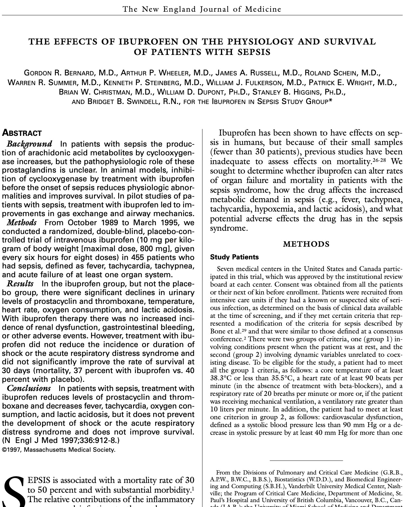

## {.custom-title background-color="#033c5a"}

::: {.ct-series}
Statistical Inference with R
:::

::: {.ct-title}
Inference for Continuous Data
:::

::: {.ct-subtitle}
Comparing means with confidence intervals, t-tests, and ANOVA
:::

::: {.ct-author}
Dan Kerchner · George Washington University Libraries & Academic Innovation · Fall 2026
:::

## Upcoming R Workshops (Fall 2026) 🗓️ {background-color="#033c5a" .divider .smaller}

- **Sept. 22 (Tues.), 12:30-2:30pm** | *Statistical Inference with R: Inference for Categorical Data*
- **Sept. 29 (Tues.), 12:30-2:30pm** | *Statistical Inference with R: Linear & Logistic Regression Modeling*
- **Oct. 1 (Thurs.), 1pm-3:30pm** | *Farther into R: More R for Data Analysis*

There will be more in the Spring!


📅 Find all GW Libraries workshops and events at
_[library.gwu.edu/events](https://library.gwu.edu/events)_

## What are we actually doing?

```{=html}
<svg class="inference-diagram" viewBox="0 0 1000 490" role="img"
     aria-label="A population of fifty figures; six are drawn at random to form a sample, each is measured, the sample mean x-bar equals 70.3 inches is computed, and that statistic is used to estimate the unknown population mean mu, giving both a point estimate and a confidence interval.">
  <defs>
    <g id="inf-person">
      <circle cx="0" cy="-8" r="4.6"/>
      <path d="M0,-2.2 c-4,0 -6.6,2.6 -6.6,6.4 V10 h13.2 V4.2 c0,-3.8 -2.6,-6.4 -6.6,-6.4 Z"/>
    </g>
    <marker id="inf-head" viewBox="0 0 10 10" refX="9" refY="5"
            markerWidth="5" markerHeight="5" orient="auto-start-reverse">
      <path d="M0,0 L10,5 L0,10 Z" class="inf-arrowhead"/>
    </marker>
    <marker id="inf-head-buff" viewBox="0 0 10 10" refX="9" refY="5"
            markerWidth="5" markerHeight="5" orient="auto-start-reverse">
      <path d="M0,0 L10,5 L0,10 Z" class="inf-arrowhead inf-arrowhead--buff"/>
    </marker>
  </defs>

  <!-- ── Population ───────────────────────────────────────────── -->
  <text class="inf-label" x="30" y="42">POPULATION<tspan class="inf-label-note" dx="10">· all GW graduate students</tspan></text>
  <rect class="inf-panel" x="30" y="52" width="400" height="250" rx="12"/>
  <g class="inf-person">
    <use href="#inf-person" transform="translate(68,98) scale(1.5)"/>
    <use href="#inf-person" transform="translate(104,98) scale(1.5)"/>
    <use href="#inf-person" transform="translate(140,98) scale(1.5)"/>
    <use href="#inf-person" transform="translate(176,98) scale(1.5)"/>
    <use href="#inf-person" transform="translate(212,98) scale(1.5)"/>
    <use href="#inf-person" transform="translate(248,98) scale(1.5)"/>
    <use href="#inf-person" transform="translate(284,98) scale(1.5)"/>
    <use href="#inf-person" transform="translate(320,98) scale(1.5)"/>
    <use href="#inf-person" transform="translate(356,98) scale(1.5)"/>
    <use href="#inf-person" transform="translate(392,98) scale(1.5)"/>
    <use href="#inf-person" transform="translate(68,140) scale(1.5)"/>
    <use href="#inf-person" transform="translate(104,140) scale(1.5)"/>
    <use href="#inf-person" transform="translate(140,140) scale(1.5)"/>
    <use href="#inf-person" transform="translate(176,140) scale(1.5)"/>
    <use href="#inf-person" transform="translate(212,140) scale(1.5)"/>
    <use href="#inf-person" transform="translate(248,140) scale(1.5)"/>
    <use href="#inf-person" transform="translate(284,140) scale(1.5)"/>
    <use href="#inf-person" transform="translate(320,140) scale(1.5)"/>
    <use href="#inf-person" transform="translate(356,140) scale(1.5)"/>
    <use href="#inf-person" transform="translate(392,140) scale(1.5)"/>
    <use href="#inf-person" transform="translate(68,182) scale(1.5)"/>
    <use href="#inf-person" transform="translate(104,182) scale(1.5)"/>
    <use href="#inf-person" transform="translate(140,182) scale(1.5)"/>
    <use href="#inf-person" transform="translate(176,182) scale(1.5)"/>
    <use href="#inf-person" transform="translate(212,182) scale(1.5)"/>
    <use href="#inf-person" transform="translate(248,182) scale(1.5)"/>
    <use href="#inf-person" transform="translate(284,182) scale(1.5)"/>
    <use href="#inf-person" transform="translate(320,182) scale(1.5)"/>
    <use href="#inf-person" transform="translate(356,182) scale(1.5)"/>
    <use href="#inf-person" transform="translate(392,182) scale(1.5)"/>
    <use href="#inf-person" transform="translate(68,224) scale(1.5)"/>
    <use href="#inf-person" transform="translate(104,224) scale(1.5)"/>
    <use href="#inf-person" transform="translate(140,224) scale(1.5)"/>
    <use href="#inf-person" transform="translate(176,224) scale(1.5)"/>
    <use href="#inf-person" transform="translate(212,224) scale(1.5)"/>
    <use href="#inf-person" transform="translate(248,224) scale(1.5)"/>
    <use href="#inf-person" transform="translate(284,224) scale(1.5)"/>
    <use href="#inf-person" transform="translate(320,224) scale(1.5)"/>
    <use href="#inf-person" transform="translate(356,224) scale(1.5)"/>
    <use href="#inf-person" transform="translate(392,224) scale(1.5)"/>
    <use href="#inf-person" transform="translate(68,266) scale(1.5)"/>
    <use href="#inf-person" transform="translate(104,266) scale(1.5)"/>
    <use href="#inf-person" transform="translate(140,266) scale(1.5)"/>
    <use href="#inf-person" transform="translate(176,266) scale(1.5)"/>
    <use href="#inf-person" transform="translate(212,266) scale(1.5)"/>
    <use href="#inf-person" transform="translate(248,266) scale(1.5)"/>
    <use href="#inf-person" transform="translate(284,266) scale(1.5)"/>
    <use href="#inf-person" transform="translate(320,266) scale(1.5)"/>
    <use href="#inf-person" transform="translate(356,266) scale(1.5)"/>
    <use href="#inf-person" transform="translate(392,266) scale(1.5)"/>
  </g>

  <!-- ── The parameter we want (always on screen) ──────────────── -->
  <rect class="inf-box inf-box--unknown" x="30" y="340" width="400" height="125" rx="12"/>
  <text class="inf-symbol" x="230" y="385" text-anchor="middle">&#956; = ?</text>
  <text class="inf-caption" x="230" y="409" text-anchor="middle">parameter &#8212; fixed, but unknown</text>

  <!-- ── The two things we want to say about it ─────────────────── -->
  <rect class="inf-goal-chip" x="50" y="422" width="172" height="34" rx="8"/>
  <text class="inf-goal" x="136" y="444" text-anchor="middle">point estimate</text>
  <rect class="inf-goal-chip" x="238" y="422" width="172" height="34" rx="8"/>
  <text class="inf-goal" x="324" y="444" text-anchor="middle">confidence interval</text>

  <!-- ── Step 1: draw the sample ───────────────────────────────── -->
  <g class="fragment">
    <g class="inf-person inf-person--drawn">
      <use href="#inf-person" transform="translate(104,98) scale(1.5)"/>
      <use href="#inf-person" transform="translate(284,98) scale(1.5)"/>
      <use href="#inf-person" transform="translate(356,140) scale(1.5)"/>
      <use href="#inf-person" transform="translate(176,182) scale(1.5)"/>
      <use href="#inf-person" transform="translate(68,224) scale(1.5)"/>
      <use href="#inf-person" transform="translate(248,266) scale(1.5)"/>
    </g>

    <circle class="inf-step-badge" cx="452" cy="138" r="14"/>
    <text class="inf-step-num" x="452" y="145" text-anchor="middle">1</text>
    <text class="inf-step" x="474" y="145">draw at random</text>
    <line class="inf-arrow" x1="440" y1="180" x2="630" y2="180" marker-end="url(#inf-head)"/>
    <text class="inf-note" x="535" y="212" text-anchor="middle">and measure each one</text>

    <text class="inf-label" x="640" y="42">SAMPLE<tspan class="inf-label-note" dx="10">· n = 6</tspan></text>
    <rect class="inf-panel inf-panel--sample" x="640" y="52" width="330" height="250" rx="12"/>
    <g class="inf-person inf-person--drawn">
      <use href="#inf-person" transform="translate(717,135) scale(2)"/>
      <use href="#inf-person" transform="translate(805,135) scale(2)"/>
      <use href="#inf-person" transform="translate(893,135) scale(2)"/>
      <use href="#inf-person" transform="translate(717,225) scale(2)"/>
      <use href="#inf-person" transform="translate(805,225) scale(2)"/>
      <use href="#inf-person" transform="translate(893,225) scale(2)"/>
    </g>
    <g class="inf-value" text-anchor="middle">
      <text x="717" y="173">68</text>
      <text x="805" y="173">74</text>
      <text x="893" y="173">71</text>
      <text x="717" y="263">66</text>
      <text x="805" y="263">70</text>
      <text x="893" y="263">73</text>
    </g>
  </g>

  <!-- ── Step 2: compute the statistic ─────────────────────────── -->
  <g class="fragment">
    <line class="inf-arrow" x1="805" y1="306" x2="805" y2="356" marker-end="url(#inf-head)"/>
    <circle class="inf-step-badge" cx="846" cy="318" r="13"/>
    <text class="inf-step-num" x="846" y="325" text-anchor="middle">2</text>
    <text class="inf-step" x="866" y="325">compute</text>
    <rect class="inf-box" x="640" y="360" width="330" height="105" rx="12"/>
    <text class="inf-symbol" x="719" y="405">x = 70.3 in</text>
    <line class="inf-symbol-bar" x1="718" y1="382" x2="740" y2="382"/>
    <text class="inf-caption" x="805" y="437" text-anchor="middle">statistic &#8212; known, but random</text>
  </g>

  <!-- ── Step 3: infer back to the parameter ───────────────────── -->
  <g class="fragment">
    <circle class="inf-step-badge inf-step-badge--buff" cx="492" cy="380" r="13"/>
    <text class="inf-step-num" x="492" y="387" text-anchor="middle">3</text>
    <text class="inf-step inf-step--buff" x="512" y="387">estimate</text>
    <line class="inf-arrow inf-arrow--dashed" x1="630" y1="412" x2="440" y2="412" marker-end="url(#inf-head-buff)"/>
    <text class="inf-note" x="535" y="442" text-anchor="middle">with uncertainty</text>
  </g>
</svg>
```

## Two forms of inference

::::: {.inf-forms style="grid-template-columns: 1fr 1.3fr;"}

:::: {.if-card .if-card--ci}
[CONFIDENCE INTERVAL]{.if-card-label}

[A range of plausible values for the parameter]{.if-card-lead}

[$95\%\text{ CI for }\mu = (67.2,\ 73.5)$]{.if-formula}

[(estimation)]{.if-card-note}
::::

:::: {.if-card .if-card--ht}
[HYPOTHESIS TEST]{.if-card-label}

[A verdict on one specific claim about the parameter]{.if-card-lead}

[$H_0: \mu = \mu_0$]{.if-hyp-sym} [null hypothesis — or like  $\mu \leq \mu_0$, or $\mu \geq \mu_0$]{.if-hyp-gloss}

[$H_A: \mu \neq \mu_0$]{.if-hyp-sym} [alternative  — or like $\mu > \mu_0$, or $\mu < \mu_0$ (respectively)]{.if-hyp-gloss}

[(decision — $H_0$ or $H_A$)]{.if-card-note}
::::

:::::

::: {.if-defs}
$p$-value
: If $H_0$ were true, the chance of getting a result **at least as extreme** as ours. [Not]{.underline} the chance that $H_0$ is true.

$\alpha$
: *Significance level* — our tolerance for rejecting $H_0$ when we should not. **Reject $H_0$ when $p < \alpha$.**
:::

::: {.if-link .fragment}
Two views of the same thing: the 95% CI is exactly the set of $\mu_0$ we would *not* reject at $\alpha = 0.05$.
:::

## Quick refresher: t-tests and ANOVA

:::: {.tt-tests}

::: {.tt-row}
[1-sample $t$-test]{.tt-name} [$H_0: \mu = \mu_0$]{.tt-null}

[If the true mean were $\mu_0$, how often would we see a sample mean **at least this far** from $\mu_0$?]{.tt-q}
:::

::: {.tt-row}
[2-sample $t$-test]{.tt-name} [$H_0: \mu_1 = \mu_2$]{.tt-null}

[If the two groups had the **same mean**, how often would we see a difference in sample means **at least this large**?]{.tt-q}
:::

::: {.tt-row}
[ANOVA]{.tt-name} [$H_0: \mu_1 = \mu_2 = \cdots = \mu_k$]{.tt-null}

[If all $k$ groups had the **same mean**, how often would we see the group means spread **at least this far** apart?]{.tt-q}
:::

::::

::: {.tt-note .fragment}
Same question every time: *assume nothing is going on, then ask how surprising our data would be.*
:::

## Paired vs. unpaired data

::::: {.pu-grid}

:::: {.pu-card}
[UNPAIRED]{.pu-label}

[Two independent groups. Nothing links a particular dot on the left to a particular dot on the right.]{.pu-lead}

```{=html}
<svg class="pu-fig" viewBox="0 0 400 210" role="img"
     aria-label="Two columns of five dots each, side by side, with no lines between them.">
  <rect class="pu-panel" x="10" y="10" width="380" height="190" rx="12"/>
  <line class="pu-axis" x1="38" y1="185" x2="38" y2="52"/>
  <polygon class="pu-axis-head" points="38,44 33,54 43,54"/>
  <text class="pu-axis-label" x="24" y="118" text-anchor="middle" transform="rotate(-90 24 118)">value</text>

  <text class="pu-col" x="150" y="28" text-anchor="middle">Group 1</text>
  <text class="pu-col" x="290" y="28" text-anchor="middle">Group 2</text>

  <g class="pu-dot pu-dot--a">
    <circle cx="150" cy="182" r="8"/>
    <circle cx="150" cy="154" r="8"/>
    <circle cx="150" cy="130" r="8"/>
    <circle cx="150" cy="104" r="8"/>
    <circle cx="150" cy="66" r="8"/>
  </g>
  <g class="pu-dot pu-dot--b">
    <circle cx="290" cy="162" r="8"/>
    <circle cx="290" cy="136" r="8"/>
    <circle cx="290" cy="104" r="8"/>
    <circle cx="290" cy="82" r="8"/>
    <circle cx="290" cy="48" r="8"/>
  </g>
</svg>
```

[2-sample $t$-test — $H_0: \mu_1 = \mu_2$]{.pu-test}
::::

:::: {.pu-card .pu-card--paired}
[PAIRED]{.pu-label}

[Each subject is measured twice. Every line is one subject, so each dot has exactly one partner.]{.pu-lead}

```{=html}
<svg class="pu-fig" viewBox="0 0 400 210" role="img"
     aria-label="The same two columns of five dots, now joined by five lines, one per subject; every line slopes upward from before to after.">
  <rect class="pu-panel" x="10" y="10" width="380" height="190" rx="12"/>
  <line class="pu-axis" x1="38" y1="185" x2="38" y2="52"/>
  <polygon class="pu-axis-head" points="38,44 33,54 43,54"/>
  <text class="pu-axis-label" x="24" y="118" text-anchor="middle" transform="rotate(-90 24 118)">value</text>

  <text class="pu-col" x="150" y="28" text-anchor="middle">before</text>
  <text class="pu-col" x="290" y="28" text-anchor="middle">after</text>

  <g class="pu-link">
    <line x1="150" y1="182" x2="290" y2="162"/>
    <line x1="150" y1="154" x2="290" y2="136"/>
    <line x1="150" y1="130" x2="290" y2="104"/>
    <line x1="150" y1="104" x2="290" y2="82"/>
    <line x1="150" y1="66"  x2="290" y2="48"/>
  </g>
  <g class="pu-dot pu-dot--a">
    <circle cx="150" cy="182" r="8"/>
    <circle cx="150" cy="154" r="8"/>
    <circle cx="150" cy="130" r="8"/>
    <circle cx="150" cy="104" r="8"/>
    <circle cx="150" cy="66" r="8"/>
  </g>
  <g class="pu-dot pu-dot--b">
    <circle cx="290" cy="162" r="8"/>
    <circle cx="290" cy="136" r="8"/>
    <circle cx="290" cy="104" r="8"/>
    <circle cx="290" cy="82" r="8"/>
    <circle cx="290" cy="48" r="8"/>
  </g>
</svg>
```

[1-sample $t$-test on the differences $d$ — $H_0: \mu_d = 0$]{.pu-test}
::::

:::::

::: {.pu-note .fragment}
Same dots on both sides — the lines are the only difference, and they are *extra information*. The two clouds overlap heavily, yet every subject went up: the paired test sees that, the unpaired test cannot. Pair only when the pairing is real.
:::

## One-tailed vs. two-tailed

::::: {.tw-grid}

:::: {.tw-card}
[TWO-TAILED]{.tw-label} [start here]{.tw-tag}

[$H_0: \mu_A = \mu_B$ &nbsp;&nbsp; $H_A: \mu_A \neq \mu_B$]{.tw-hyp}

[that is, $\mu_A > \mu_B$ **or** $\mu_A < \mu_B$]{.tw-sub}

```{=html}
<svg class="tw-fig" viewBox="0 0 400 150" role="img"
     aria-label="A t distribution with both tails shaded, each holding alpha over two.">
  <path class="tw-tail" d="M20,120 L20,119.6 L24,119.5 L28,119.3 L32,119.2 L36,118.9 L40,118.7 L44,118.4 L48,118.0 L52,117.6 L56,117.1 L60,116.5 L64,115.8 L68,114.9 L72,114.0 L76,112.9 L80,111.7 L84,110.3 L88,108.7 L92,106.9 L92,120 Z"/>
  <path class="tw-tail" d="M308,120 L308,106.9 L312,108.7 L316,110.3 L320,111.7 L324,112.9 L328,114.0 L332,114.9 L336,115.8 L340,116.5 L344,117.1 L348,117.6 L352,118.0 L356,118.4 L360,118.7 L364,118.9 L368,119.2 L372,119.3 L376,119.5 L380,119.6 L380,120 Z"/>
  <path class="tw-curve" d="M20,120 L20,119.6 L24,119.5 L28,119.3 L32,119.2 L36,118.9 L40,118.7 L44,118.4 L48,118.0 L52,117.6 L56,117.1 L60,116.5 L64,115.8 L68,114.9 L72,114.0 L76,112.9 L80,111.7 L84,110.3 L88,108.7 L92,106.9 L96,104.9 L100,102.8 L104,100.4 L108,97.8 L112,95.0 L116,92.0 L120,88.8 L124,85.4 L128,81.8 L132,78.1 L136,74.3 L140,70.4 L144,66.4 L148,62.4 L152,58.5 L156,54.6 L160,50.9 L164,47.4 L168,44.0 L172,40.9 L176,38.2 L180,35.8 L184,33.7 L188,32.1 L192,30.9 L196,30.2 L200,30.0 L204,30.2 L208,30.9 L212,32.1 L216,33.7 L220,35.8 L224,38.2 L228,40.9 L232,44.0 L236,47.4 L240,50.9 L244,54.6 L248,58.5 L252,62.4 L256,66.4 L260,70.4 L264,74.3 L268,78.1 L272,81.8 L276,85.4 L280,88.8 L284,92.0 L288,95.0 L292,97.8 L296,100.4 L300,102.8 L304,104.9 L308,106.9 L312,108.7 L316,110.3 L320,111.7 L324,112.9 L328,114.0 L332,114.9 L336,115.8 L340,116.5 L344,117.1 L348,117.6 L352,118.0 L356,118.4 L360,118.7 L364,118.9 L368,119.2 L372,119.3 L376,119.5 L380,119.6"/>
  <line class="tw-base" x1="16" y1="120" x2="384" y2="120"/>
  <text class="tw-alpha" x="70" y="139" text-anchor="middle">&#945;/2</text>
  <text class="tw-alpha" x="330" y="139" text-anchor="middle">&#945;/2</text>
  <text class="tw-axis-label" x="384" y="139" text-anchor="end">t</text>
</svg>
```

[$\alpha$ is split between the tails — catches a difference in **either** direction.]{.tw-foot}
::::

:::: {.tw-card .tw-card--one}
[ONE-TAILED]{.tw-label} [only with a reason]{.tw-tag}

[$H_0: \mu_A \leq \mu_B$ &nbsp;&nbsp; $H_A: \mu_A > \mu_B$]{.tw-hyp}

[*or* the mirror image: $H_0: \mu_A \geq \mu_B$ &nbsp; $H_A: \mu_A < \mu_B$ — pick **one**]{.tw-sub}

```{=html}
<svg class="tw-fig" viewBox="0 0 400 150" role="img"
     aria-label="The same t distribution with only the right tail shaded, holding all of alpha.">
  <path class="tw-tail" d="M292,120 L292,97.8 L296,100.4 L300,102.8 L304,104.9 L308,106.9 L312,108.7 L316,110.3 L320,111.7 L324,112.9 L328,114.0 L332,114.9 L336,115.8 L340,116.5 L344,117.1 L348,117.6 L352,118.0 L356,118.4 L360,118.7 L364,118.9 L368,119.2 L372,119.3 L376,119.5 L380,119.6 L380,120 Z"/>
  <path class="tw-curve" d="M20,120 L20,119.6 L24,119.5 L28,119.3 L32,119.2 L36,118.9 L40,118.7 L44,118.4 L48,118.0 L52,117.6 L56,117.1 L60,116.5 L64,115.8 L68,114.9 L72,114.0 L76,112.9 L80,111.7 L84,110.3 L88,108.7 L92,106.9 L96,104.9 L100,102.8 L104,100.4 L108,97.8 L112,95.0 L116,92.0 L120,88.8 L124,85.4 L128,81.8 L132,78.1 L136,74.3 L140,70.4 L144,66.4 L148,62.4 L152,58.5 L156,54.6 L160,50.9 L164,47.4 L168,44.0 L172,40.9 L176,38.2 L180,35.8 L184,33.7 L188,32.1 L192,30.9 L196,30.2 L200,30.0 L204,30.2 L208,30.9 L212,32.1 L216,33.7 L220,35.8 L224,38.2 L228,40.9 L232,44.0 L236,47.4 L240,50.9 L244,54.6 L248,58.5 L252,62.4 L256,66.4 L260,70.4 L264,74.3 L268,78.1 L272,81.8 L276,85.4 L280,88.8 L284,92.0 L288,95.0 L292,97.8 L296,100.4 L300,102.8 L304,104.9 L308,106.9 L312,108.7 L316,110.3 L320,111.7 L324,112.9 L328,114.0 L332,114.9 L336,115.8 L340,116.5 L344,117.1 L348,117.6 L352,118.0 L356,118.4 L360,118.7 L364,118.9 L368,119.2 L372,119.3 L376,119.5 L380,119.6"/>
  <line class="tw-base" x1="16" y1="120" x2="384" y2="120"/>
  <text class="tw-alpha" x="320" y="139" text-anchor="middle">all of &#945;</text>
  <text class="tw-axis-label" x="384" y="139" text-anchor="end">t</text>
</svg>
```

[All of $\alpha$ sits in one tail — more power that way, **none at all** the other way.]{.tw-foot}
::::

:::::

::: {.tw-warn .fragment}
**Choose the tail from the science, before you see the data.** Picking it afterwards because that is
where the difference landed makes a "5%" test really a 10% one. And if the effect turns up in the other
tail, a one-tailed test cannot report it — however large it is. When in doubt, two-tailed: it is what
`t.test()` does by default, and what most readers assume.
:::
## What the t-test and ANOVA assume

::: {.as-shared}
[BOTH TESTS]{.as-head}

1. **Independent observations** — within each group *and* across groups
2. **Normality** — either the values within each group are roughly normal, **or** $n$ is large enough that the *sample mean* is
3. **A continuous outcome** — a mean has to mean something
:::

::::: {.as-grid}

:::: {.as-card}
[2-SAMPLE $t$-TEST ALSO]{.as-label}

[**Roughly equal variances** — `t.test()` defaults to Welch's approximation, which does not assume it. Check with `var.test()`.]{.as-body}
::::

:::: {.as-card .as-card--anova}
[ANOVA ALSO]{.as-label}

[**Roughly equal variances across all $k$ groups.** Check with `bartlett.test()` if normal, `car::leveneTest()` if not. Welch version: `oneway.test(var.equal = FALSE)`.]{.as-body}
::::

:::::

::: {.as-foot}
**Not satisfied?** Use a nonparametric test (Wilcoxon, Kruskal-Wallis), a bootstrap or permutation test, or a transformation. **Independence is non-negotiable** — no alternative test rescues it. That one needs a different design or model such as a paired test, or a mixed model.
:::

::: {.as-myth .fragment}
**"$n \geq 30$" is a rule of thumb, not a requirement.** With normal data the $t$-test is exact at *any* $n$ — small samples are exactly what Gosset built it for. With badly skewed data, 30 can be nowhere near enough. You need normality **or** a large $n$, not both.
:::

## Today's goals

Learn to use R to read in data and conduct hypothesis tests for continuous measures  

- Checking assumptions  
- Visualizing  
- Computing p-values and confidence intervals

## Today: 4 Scenarios

- Single-sample t-test  
- Paired t-test (same people, measured twice)  
- 2-sample t-test (different people in each group)  
- ANOVA (inference for means from more than 2 independent groups)

## Today's data set

::::: {.ds-grid}

:::: {.ds-cite}

<br>  

Bernard, G. R., Wheeler, A. P., Russell, J. A., Schein, R., Summer, W. R., Steinberg, K. P., Fulkerson, W. J., Wright, P. E., Christman, B. W., Dupont, W. D., Higgins, S. B., & Swindell, B. B. (1997). The effects of ibuprofen on the physiology and survival of patients with sepsis. _New England Journal of Medicine, 336_(13), 912–918.

[doi.org/10.1056/NEJM199703273361303](https://doi.org/10.1056/NEJM199703273361303)
::::

:::: {.ds-img}
{fig-alt="First page of the 1997 New England Journal of Medicine paper on ibuprofen in the treatment of sepsis."}
::::

:::::

## Thanks! 🎶 

**Dan Kerchner** | George Washington University Libraries   
[kerchner@gwu.edu](mailto:kerchner@gwu.edu)

Appointments:

|  |  |   |
|---|---|----------------|
| me | R, Python, etc. | [calendly.com/kerchner](https://calendly.com/kerchner)  |
| Academic Commons Data Consultants | R, Statistics, Python, SAS, Excel, etc. | [go.gwu.edu/DataConsulting](https://go.gwu.edu/DataConsulting) |
| LAI Software developers | Python, web apps, HTML, etc. | [calendly.com/gwul-coding](https://calendly.com/gwul-coding) |

: {tbl-colwidths="[30,35,35]"}

These slides: [kerchner.github.io/r4stats/continuous](https://kerchner.github.io/r4stats/continuous)  
Code: [github.com/kerchner/r4stats/](https://github.com/kerchner/r4stats) in the `continuous/R` folder  
R LibGuide: [libguides.gwu.edu/r_stats](https://libguides.gwu.edu/r_stats)
